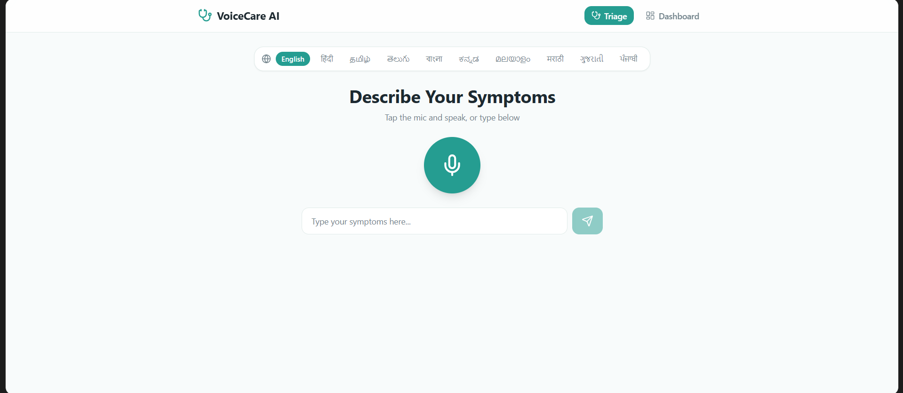

# VoiceCare AI – Intelligent Health Triage System

## Overview
VoiceCare AI is a voice-based healthcare assistant that helps users describe symptoms in their native language and converts them into structured medical insights with risk classification and recommendations.

## Features
- Voice/Text symptom input
- AI-based symptom extraction
- Risk scoring (Low / Medium / High)
- Actionable recommendations
- Simple and accessible UI

## Tech Stack
- Frontend: React
- Backend: Node.js
- AI: OpenAI API
- Speech: Web Speech API

## How It Works
User Input → AI Processing → Risk Scoring → Recommendation

## Setup
1. Clone repo
2. Add API key in `.env`
3. Run backend: `node index.js`
4. Run frontend: `npm start`

## Demo

## Future Scope
- Multi-language support
- PHC integration
- Outbreak monitoring

## Team Member
- Akshat Singh (Frontend Development)
- Aditya Singh Jadon (Backend Development)
- Ankita (Artificial Intelligence)
